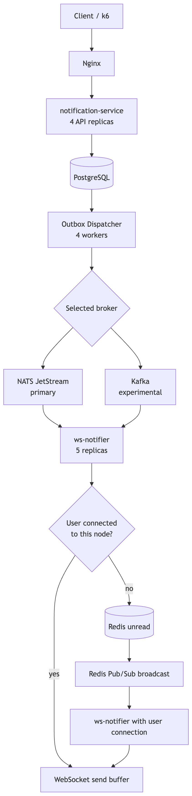

# Архитектура Notification Platform

Актуально на 21 июля 2026 года.

## 1. Назначение

Notification Platform - распределённая платформа доставки уведомлений на Go.

Основной брокерный путь проекта построен на **NATS JetStream**. Поддержка **Apache Kafka добавлена экспериментально** для проверки и сравнения поведения двух транспортов под одинаковой нагрузкой.

Система решает следующие задачи:

- атомарное создание уведомления и outbox-события;
- асинхронная публикация через выбранный брокер;
- доставка online-пользователям через WebSocket;
- временное хранение сообщений для offline-пользователей;
- горизонтальное масштабирование REST API и WebSocket-нод;
- наблюдаемость и end-to-end нагрузочное тестирование.

NATS и Kafka реализуют общие интерфейсы. Бизнес-логика сервисов не зависит напрямую от `nats.go` или `franz-go`.

## 2. Общая схема

<p align="center">
  <a href="docs/images/mermaid-diagram-2026-07-21-175043.png">
    
  </a>
</p>

## 3. Runtime-топология Docker Compose

| Компонент | Количество | Назначение                              |
|---|---:|-----------------------------------------|
| Nginx | 1 | REST и WebSocket load balancing         |
| `notification-service`, API | 4 | Обработка REST-запросов                 |
| `notification-service`, dispatcher | 1 | Четыре outbox-воркера и OutboxSyncer    |
| `ws-notifier` | 5 | Consumers, Redis и WebSocket            |
| PostgreSQL | 1 | Notifications и transactional outbox    |
| Redis | 1 | Unread storage и cross-node broadcast   |
| NATS JetStream | 1 | Основной брокер                         |
| Kafka | 1 | Экспериментальный альтернативный брокер |

`notification-service-1` запускает background workers через `OUTBOX_DISPATCHER_ENABLED`. Остальные экземпляры работают в API-only режиме.

Nginx направляет REST-запросы в четыре API-реплики, а WebSocket-подключения распределяет между пятью `ws-notifier` по `least_conn`.

Пулы PostgreSQL ограничены на уровне каждого процесса, чтобы суммарное количество соединений не превышало возможности локальной PostgreSQL.

## 4. Компоненты

### notification-service

Ответственность:

- принимает `POST /notifications`;
- создаёт `notifications` и `outbox_events` в одной транзакции;
- запускает outbox dispatcher на выделенной ноде;
- публикует сообщения через общий интерфейс `messaging.Publisher`;
- синхронизирует статусы через `OutboxSyncer`.

### ws-notifier

Ответственность:

- подключается к выбранному брокеру;
- обрабатывает сообщения и broker acknowledgement;
- хранит активные WebSocket-соединения;
- доставляет сообщение локально или через Redis;
- обновляет статус outbox-события;
- выдаёт накопленные unread-сообщения при подключении пользователя.

### PostgreSQL

Хранит:

- основную модель уведомления;
- outbox-событие и payload;
- состояние обработки;
- время создания и доставки;
- счётчик попыток публикации.

### Redis

Используется для:

- временного хранения unread-сообщений;
- TTL в зависимости от приоритета;
- broadcast между экземплярами `ws-notifier`.

### Nginx

Разделяет маршруты:

- `/notifications` и остальные REST-маршруты -> API backend;
- `/ws` -> WebSocket backend;
- `/metrics/ns` -> `notification-service`;
- `/metrics/ws` -> `ws-notifier`.

## 5. Transactional outbox

Создание уведомления выполняется одной PostgreSQL-транзакцией:

```text
BEGIN
  INSERT notifications
  INSERT outbox_events
COMMIT
```

Это гарантирует, что основная запись и outbox-событие либо создаются вместе, либо не создаются вообще.

Dispatcher запускает четыре ограниченных worker goroutine.

Каждый worker:

1. выбирает `pending` события через `FOR UPDATE SKIP LOCKED`;
2. переводит выбранные записи в `sent`;
3. публикует их через общий `Publisher`;
4. при явной ошибке публикации возвращает событие в `pending`;
5. увеличивает размер batch при наличии постоянной работы.

Параметры dispatcher:

| Параметр | Значение |
|---|---:|
| Worker count | 4 |
| Minimum batch | 40 |
| Maximum batch | 500 |
| Base poll interval | 350 ms |
| Maximum idle poll interval | 1500 ms |
| Publish timeout | 10 s |

При постоянном backlog workers работают практически без polling-пауз. При небольшой нагрузке сообщение может ожидать следующего polling до 350 ms и более.

## 6. Абстракция брокера

Публикация описана общим интерфейсом:

```go
type Publisher interface {
    Publish(
        ctx context.Context,
        userID string,
        message model.NatsMessage,
    ) error

    Close()
}
```

`notification-service` выбирает реализацию по `broker_type`.

`ws-notifier` аналогично выбирает реализацию общего `Subscriber`.

## 7. NATS JetStream - основной путь

### Producer

- Stream использует `WorkQueuePolicy`.
- Subject формируется как `notifications_new.<userID>`.
- Публикация ожидает JetStream publish acknowledgement.
- В качестве `MsgID` используется `notif-<eventID>`.
- Окно broker-side deduplication составляет 10 секунд.

### Consumer

Пять экземпляров `ws-notifier` совместно используют один durable pull consumer:

```text
notification-service-ws-pull
```

Основные настройки:

| Параметр | Значение |
|---|---:|
| Ack policy | Explicit |
| Ack wait | 180 s |
| Max deliver | 10 |
| Max ack pending | 50 000 |
| Pull prefetch | 64 messages |

`PullMaxMessages(64)` ограничивает клиентский prefetch, но сам по себе не создаёт 64 параллельных обработчика.

В используемой версии `nats.go` callback `Consume` вызывается последовательно внутри одного экземпляра `ws-notifier`. Это не означает полного отсутствия параллелизма во всём стенде: пять экземпляров совместно получают сообщения одного durable consumer и образуют пять независимых processing pipelines.

Обработка результата:

- некорректный JSON -> `Term()`;
- успешный enqueue локальному WebSocket -> `Ack()`;
- пользователь не найден локально -> сохранение в Redis, broadcast и `Ack()`;
- временная ошибка Redis -> `NakWithDelay(2s)`.

## 8. Kafka - экспериментальный путь

Kafka-адаптер добавлен для проверки общей архитектурной границы и сравнительного тестирования. Он использует те же модели, outbox и WebSocket/Redis delivery-path, но пока не является основным поддерживаемым транспортом проекта.

### Producer

- Используется один topic `notifications`.
- Topic создаётся с пятью partitions и replication factor 1.
- `userID` используется как record key.
- Сообщения одного пользователя попадают в одну partition.
- Публикация выполняется через `ProduceSync`.
- Producer ожидает acknowledgement всех in-sync replicas.

### Consumer

Все экземпляры `ws-notifier` входят в consumer group:

```text
ws-notifier
```

При пяти partitions и пяти consumer instances Kafka может назначить каждой ноде отдельную partition.

Основные настройки:

| Параметр | Значение |
|---|---:|
| Partitions | 5 |
| Poll limit | 500 records |
| Fetch max wait | 500 ms |
| Auto commit | Disabled |
| Rebalance during processing | Blocked |
| Session timeout | 30 s |

Записи каждой partition обрабатываются последовательно.

После обработки poll:

1. выбирается последняя успешно обработанная запись каждой partition;
2. выполняется один синхронный `CommitRecords`;
3. разрешается rebalance.

## 9. Сравнение реализаций брокеров

| Характеристика | NATS JetStream | Kafka, experimental |
|---|---|---|
| Роль в проекте | Основной путь | Сравнительный адаптер |
| Маршрутизация | Subject с `userID` | Topic key с `userID` |
| Распределение нагрузки | Общий durable pull consumer | Consumer group |
| Параллелизм стенда | 5 consumer instances | 5 partitions / 5 instances |
| Буфер чтения | Pull prefetch 64 | Poll до 500 records |
| Подтверждение | Explicit `Ack()` | Manual offset commit |
| Временная ошибка | `NakWithDelay()` | Recovery внутри уже полученного batch пока не гарантирован |
| Неисправимый JSON | `Term()` | Skip и commit |
| Producer acknowledgement | JetStream server ACK | `ProduceSync` + all ISR ACK |


## 10. WebSocket delivery

Для каждого подключения создаётся `Client`:

- отдельный bounded send channel;
- `readPump`;
- `writePump`;
- context cancellation;
- одноразовый cleanup через `sync.Once`.

`SendToUser` выполняет неблокирующую постановку сообщения во внутренний буфер. Mutex защищает enqueue от конкурентного удаления клиента, поэтому канал не закрывается конкурентно и устранён сценарий `panic: send on closed channel`.

Текущая граница успешной доставки:

```text
broker message
  -> accepted by WebSocket send buffer
  -> status=delivered
  -> broker ACK/commit
  -> writePump writes to socket later
```

Следовательно, `delivered` пока означает internal enqueue, а не подтверждение записи в socket или получения сообщения клиентом.

## 11. Межнодовая и offline-доставка

Broker consumer получает сообщение только на одной ноде.

Если пользователь подключён к этой ноде, сообщение передаётся напрямую в WebSocket buffer.

Если пользователь находится на другой ноде:

1. сообщение сохраняется в Redis;
2. публикуется в общий Redis Pub/Sub channel;
3. все `ws-notifier` получают broadcast;
4. нода с соединением пользователя отправляет сообщение;
5. unread-запись удаляется из Redis.

При подключении offline-пользователя `ws-notifier` читает накопленные сообщения из Redis и помещает их в WebSocket buffer.

## 12. Порядок сообщений

Нагрузочный тест считает сообщение нарушившим порядок, если новый `event_id` меньше максимального ранее полученного ID этого пользователя.

Последние результаты:

| Профиль | NATS | Kafka, experimental |
|---|---:|---:|
| Normal 800 | 1.30% | 1.31% |
| Stress 2000 | 1.10% | 1.24% |

Основной вероятный источник - общий outbox dispatcher:

- четыре workers независимо захватывают соседние диапазоны событий;
- один worker может опубликовать более поздний диапазон раньше другого;
- брокер сохраняет порядок фактической публикации, а не исходный порядок записей в БД.

Строгая per-user ordering пока не является целевой гарантией системы.

## 13. Результаты нагрузочного тестирования

Окружение:

- локальный Docker Compose;
- 1500 WebSocket-клиентов;
- четыре API-реплики;
- пять `ws-notifier`;
- один dispatcher с четырьмя workers;
- один экземпляр каждого инфраструктурного компонента.

Результаты от 21 июля 2026 года:

| Профиль | Брокер | Created | Unique WS | Delivery avg | Delivery p95 | Delivery max | HTTP p95 | Dropped k6 |
|---|---|---:|---:|---:|---:|---:|---:|---:|
| Normal 800 | NATS | 182 999 | 182 999 | 168.70 ms | 331 ms | 871 ms | 1.71 ms | 0 |
| Normal 800 | Kafka, experimental | 182 999 | 182 999 | 168.19 ms | 334 ms | 593 ms | 1.75 ms | 0 |
| Stress 2000 | NATS | 397 394 | 397 394 | 63.97 ms | 249 ms | 1.10 s | 2.21 ms | 105 |
| Stress 2000 | Kafka, experimental | 397 499 | 397 499 | 64.01 ms | 240 ms | 1.39 s | 2.50 ms | 0 |

Во всех тестах:

- 100% созданных уведомлений были уникально получены через WebSocket;
- duplicate messages: 0;
- invalid WebSocket messages: 0;
- WebSocket connection failures: 0.

Normal-профиль имеет более высокую медианную delivery latency, чем stress. Вероятная причина - polling outbox с базовым интервалом 350 ms. При 800 RPS workers периодически опустошают очередь и засыпают; при 2000 RPS очередь остаётся заполненной и workers работают непрерывно.

Результаты Kafka подтверждают работоспособность экспериментального адаптера в положительном сценарии, но не заменяют отдельные integration, recovery и rebalance tests.

## 14. Delivery semantics

Текущие подтверждённые свойства:

- `notifications` и `outbox_events` создаются атомарно;
- явная ошибка публикации возвращает событие в `pending`;
- NATS не ACK-ает сообщение до успешного локального enqueue или сохранения в Redis;
- Kafka использует manual commit после успешной обработки, но повторная обработка записи после ошибки внутри уже полученного batch пока не гарантирована;
- в положительных нагрузочных тестах потери и дубли не обнаружены.

Система пока не заявляет полную end-to-end `at-least-once` гарантию во всех crash-сценариях.

## 15. Известные ограничения и пути их устранения

Ограничения этого раздела являются осознанным техническим долгом.

### 15.1 ACK означает enqueue, а не доставку

Утверждение подтверждается текущим кодом. `SendToUser` возвращает успех после записи в buffered channel. Фактический `WriteMessage` выполняется позже в `writePump` и может завершиться ошибкой. Тем не менее сообщение уже отмечается `delivered`, а NATS получает ACK или Kafka продвигает offset.

Риск: поздняя ошибка socket write может произойти после фиксации успешной доставки.

Планируемое исправление:

- определить, считается ли доставкой успешный socket write или application-level ACK клиента;
- возвращать результат работы writer;
- до подтверждения хранить сообщение в Redis или другом durable storage;
- только затем выставлять `delivered` и подтверждать сообщение брокеру.

### 15.2 NATS не обрабатывает callback параллельно внутри одной ноды

Утверждение верно на уровне одного `ws-notifier`: callback `Consume` в используемой версии `nats.go` выполняется последовательно. `PullMaxMessages(64)` является prefetch-ограничением, а не worker pool.

При этом утверждение «NATS полностью последовательный» для всей системы неверно: пять экземпляров `ws-notifier` совместно используют durable consumer, поэтому стенд имеет до пяти параллельных processing pipelines.

Планируемое исправление при необходимости дальнейшего увеличения throughput:

- bounded worker pool;
- стабильное шардирование по `userID`;
- последовательная очередь внутри каждого shard;
- корректный drain worker pool во время graceful shutdown.

Простая goroutine на каждое сообщение не подходит: она создаст неограниченный параллелизм и усилит нарушение порядка одного пользователя.

### 15.3 Redis broadcast создаёт N-кратный трафик

Утверждение подтверждается текущей архитектурой. Все экземпляры `ws-notifier` подписаны на один Pub/Sub channel, поэтому каждое межнодовое сообщение получают и разбирают все ноды.

Риск: добавление `ws-notifier` увеличивает broadcast fan-out и нагрузку на Redis, даже если пользователь подключён только к одной ноде.

Планируемое исправление:

- presence mapping `userID -> nodeID` с TTL;
- адресный channel или queue для каждой ноды;
- fallback в unread storage при устаревшем presence;
- удаление unread только после подтверждённой доставки.

### 15.4 Авторизация WebSocket фактически отсутствует

Утверждение подтверждается текущим кодом. Любой непустой token считается валидным, а `userID` берётся из query-параметра. WebSocket upgrader также разрешает все origin.

Риск: в открытом окружении клиент может выбрать чужой `userID` и попытаться читать его уведомления.

Планируемое исправление:

- проверка JWT или session token;
- получение `userID` только из доверенных claims;
- проверка audience, issuer и срока действия;
- allowlist допустимых WebSocket origins.

### 15.5 Outbox crash gap

Claim переводит событие в `sent` до broker publish. Если процесс аварийно завершится между commit claim-транзакции и публикацией, событие останется в `sent`. Обычная ошибка `Publish` обрабатывается возвратом в `pending`, но crash-сценарий этим не закрывается.

Планируемое исправление:

```text
pending
  -> processing with lease
  -> publish
  -> sent

processing with expired lease
  -> pending
```

Ошибка возврата в `pending` также должна проверяться и наблюдаться отдельной метрикой.

### 15.6 Порядок сообщений одного пользователя

Четыре outbox-воркера могут публиковать соседние диапазоны событий в разном порядке. Общий NATS consumer и Redis broadcast также не задают per-user serialization.

Планируемое исправление:

- явный per-user sequence number;
- шардирование dispatcher/consumer по `userID`;
- bounded queues и последовательная обработка внутри shard;
- отдельный строгий order-test.

### 15.7 Offline cleanup

GetUnread асинхронно запускает очистку Redis сразу после чтения сообщений, до подтверждённого enqueue и доставки. Cleanup также использует поиск Redis-ключей по шаблону

Планируемое исправление:

- удалять конкретный `eventID`;
- отказаться от `KEYS` на runtime-path;
- связать cleanup с выбранной семантикой delivery acknowledgement.

### 15.8 Testing и инфраструктура

- Автоматические Go unit/integration tests пока отсутствуют.
- Kafka recovery, rebalance и duplicate-delivery scenarios отдельно не протестированы.
- Нет fault-injection тестов для падения между outbox claim и publish.
- Docker Compose использует одиночные экземпляры PostgreSQL, Redis, NATS и Kafka без replication и failover.

Планируемое развитие:

- unit tests для repository, dispatcher и WebSocket manager;
- integration tests для обоих broker adapters;
- race tests для WebSocket lifecycle;
- broker restart и consumer rebalance tests;
- CI с `gofmt`, `go vet`, `go test` и проверкой k6 scripts.
